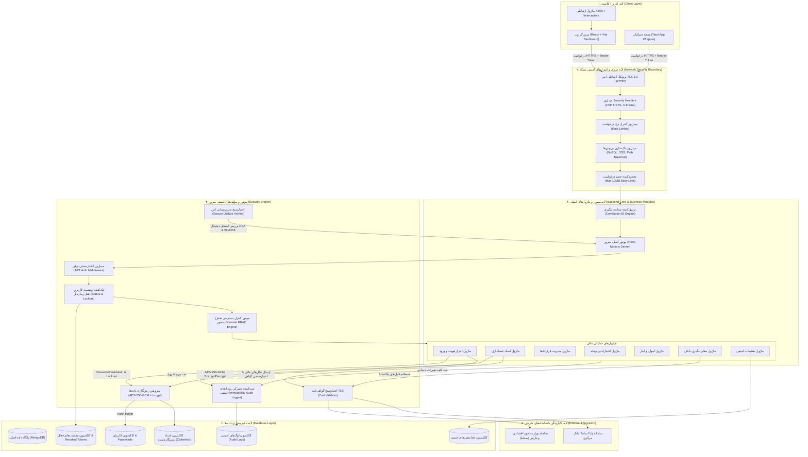

# سند معماری محصول (مخصوص ارائه به مرکز ارزیابی امنیتی افتا)

**نام محصول:** سامانه جامع نظام مالی بخش عمومی (Public Finance Management System)  
**نوع محصول:** برنامه کاربردی تحت شبکه (Web-Based Application)  
**نسخه:** 1.0.0  

---

## ۱. نمای کلی و نمودار معماری سیستم (System Architecture Diagram)

نمودار زیر گردش اطلاعات، لایه‌های مختلف نرم‌افزاری، مؤلفه‌های امنیتی، کلاینت و سامانه یکپارچگی خارجی (سامانه سناما و بانک‌ها) را بر اساس معماری واقعی محصول نشان می‌دهد:



---

## ۲. تشریح بخش‌های مختلف معماری مطابق الزامات افتا

### الف) مؤلفه‌های سمت کلاینت (Client-Side Components)
- **مرورگر وب (Web Browser Dashboard):** پیاده‌سازی شده با **React 18** و **Vite** جهت ارائه رابط کاربر مالی.
- **برنامه دسکتاپ (Tauri Container):** محفظه دسکتاپ برای محیط‌های آفلاین یا ایزوله مالی با منطق کلاینت یکسان.
- **مدیریت نشست و توکن:** توکن JWT پس از دریافت از سرور صرفاً در حافظه قرار گرفته و در هدر `Authorization: Bearer <token>` ارسال می‌شود.
- **تزریق شناسه پیگیری (Correlation ID Interceptor):** هر درخواست خروجی از کلاینت دارای هدر یکتای `X-Correlation-ID` است تا ردگیری خطاهای امنیتی در لایه‌های بعدی امکان‌پذیر باشد.

---

### ب) مؤلفه‌های امنیتی (Security Components)
۱. **میدل‌ور Security Headers:** تنظیم هدرهای استاندارد حفاظتی شامل `Content-Security-Policy`, `X-Content-Type-Options: nosniff`, `X-Frame-Options: DENY`, `Referrer-Policy` و `Strict-Transport-Security`.
۲. **میدل‌ور نرخ درخواست (Rate Limiter):** محدودسازی تعداد درخواست‌ها بر اساس IP و حساب کاربری (۱۰ درخواست در دقیقه برای ورود، ۳۰۰ درخواست در دقیقه برای سایر APIها).
۳. **میدل‌ور پاک‌سازی ورودی‌ها (Input Sanitizer):** تحلیل و فیلتر کردن تمامی پارامترها جهت جلوگیری از NoSQL Injection، XSS و Path Traversal.
۴. **موتور احراز هویت و قفل زمان‌دار (Auth & Account Lockout):** ارزیابی وضعیت حساب (`فعال`, `غیرفعال`, `مسدود`)، قفل اتوماتیک ۱۵ دقیقه‌ای حساب کاربر در صورت ۵ تلاش ناموفق متوالی.
۵. **موتور کنترل دسترسی مبتنی بر نقش و مجوز (RBAC Engine):** اعتبارسنجی دقیق نقش کاربر (`admin`, `حسابدار`, `سرپرست`) و مجوزهای ریزدانه (`doc.create`, `doc.edit`, `doc.approve`, `export.data`) در لایه بک‌اند.
۶. **ماژول ثبت رخدادهای امنیتی (Audit Logger):** ثبت متمرکز رویدادهای امنیتی در دیتابیس با قابلیت ماسک کردن اطلاعات حساس (`password`, `token`, `secret`) به همراه IP، UserAgent و شناسه Correlation ID.
۷. **سرویس رمزنگاری (Crypto Service):**
   - در حالت سکون (At Rest): رمزنگاری داده‌های حساس اسناد با الگوریتم **AES-256-GCM** (کلید ۳۲ بایتی + IV تصادفی ۱۲ بایتی + Auth Tag).
   - کلمات عبور: هش‌سازی با الگوریتم استاندارد **bcrypt** و فاکتور پیچیدگی ۱۲.
۸. **اعتبارسنج گواهی‌نامه TLS (Cert Validator):** بررسی اعتبار گواهی‌نامه‌های SSL/TLS، تاریخ منقضی نشدن و دامنه هنگام اتصال به سامانه‌های خارجی (Fail-Secure).
۹. **اعتبارسنج به‌روزرسانی امن (Secure Update Verifier):** بررسی هش **SHA-256** و امضای دیجیتال **RSA** بسته‌های آپدیت پیش از نصب.

---

### ج) مؤلفه‌ها و ماژول‌های اصلی سرور (Core Server Modules)
- **موتور اصلی سرور:** پیاده‌سازی شده بر پایه **Hono Framework** و **Node.js**.
- **ماژول اسناد حسابداری (Journal Documents):** ثبت، ویرایش، تایید نهایی و مانده‌گیری اسناد.
- **ماژول مدیریت قراردادها و اعتبارات:** ثبت پیمانکاران، ضمانت‌نامه‌ها، متمم‌ها و تخصیص بودجه.
- **ماژول مغایرت‌گیری بانکی:** پردازش فایل‌های صورت‌حساب بانکی و تطبیق تراکنش‌ها.
- **ماژول مدیریت امنیت (Security Administration):** مدیریت خط‌مشی‌های گذرواژه، قفل حساب، انقضای نشست و مشاهده لوگ‌های امنیتی توسط مدیر سیستم.

---

### د) مؤلفه‌های یکپارچگی با سامانه‌های خارجی (External Integration)
- **سامانه سناما (وزارت امور اقتصادی و دارایی):** جهت ارسال صورت‌های مالی استاندارد، فرم‌های اعتبارات ابلاغی/تخصیصی و شناسه پروژه‌ها با اعتبارسنجی گواهی‌نامه TLS.
- **سامانه‌های بانکی (پایا / ساتنا):** جهت دریافت فایل‌های پایا و صورت‌حساب‌های بانکی استاندارد با لایه کانال امن ارتباطی.

---

## ۳. گردش اطلاعات و فرآیندهای عمومی و امنیتی (Information Flow & Processes)

### گردش ۱: فرآیند احراز هویت و ورود کاربر
```
[کاربر] ──(۱. نام کاربری و پسوورد)──> [Input Sanitizer & Rate Limiter]
                                               │
                                       (۲. اعتبارسنجی نرخ و ورودی)
                                               ▼
[Audit Log DB] <──(۴. ثبت لوگ موفق/ناموفق)── [موتور Auth سرور]
                                               │
                                       (۳. چک وضعیت و bcrypt)
                                               ▼
[کلاینت] <──(۵. توکن JWT + Session ID)── [ایجاد نشست در Active Sessions]
```

### گردش ۲: فرآیند ثبت و ذخیره‌سازی سند مالی حساس
```
[کلاینت] ──(۱. payload سند + JWT)──> [میدل‌ور requireAuth & RBAC]
                                           │
                                   (۲. اعتبارسنجی مجوز doc.create)
                                           ▼
[Crypto Service] ──(۳. AES-256-GCM Encrypt)──> [پایگاه داده (MongoDB)]
       │                                              │
(۴. ماسک Secrets)                                 (ذخیره ciphertext)
       ▼                                              │
[Audit Log DB] <──────(۵. ثبت لوگ تغییرات مالی)────────┘
```

### گردش ۳: فرآیند خروج امن و ابطال نشست (Logout / Revocation)
```
[کلاینت] ──(۱. درخواست Logout)──> [روت auth/logout سرور]
                                         │
                                 (۲. درج توکن در revoked_tokens)
                                 (۳. حذف نشست از active_sessions)
                                         ▼
[Audit Log DB] <──(۴. ثبت لوگ خروج موفق)── [پاسخ 200 OK و پاک‌سازی کلاینت]
```

---

## ۴. جدول خلاصه تبادل اطلاعات و مشخصات داده‌ها

| منبع پیام | مقصد پیام | نوع اطلاعات تبادلی | کانال ارتباطی / پروتکل | کنترل‌های امنیتی اعمال‌شده |
|---|---|---|---|---|
| مرورگر کلاینت | سرور Hono | اطلاعات احراز هویت (User/Pass) | HTTPS / TLS 1.3 | Rate Limiting, Password Policy, Constant-Time Verify, Audit Log |
| مرورگر کلاینت | سرور Hono | داده‌های مالی اسناد و قراردادها | HTTPS + Bearer JWT | RBAC Permission Enforce, Correlation ID, NoSQL Sanitizer |
| سرور Hono | پایگاه داده MongoDB | اطلاعات کاربران و پسووردها | MongoDB Driver / Local Auth | bcrypt Hashing (Cost 12), Exclusion from Projections |
| سرور Hono | پایگاه داده MongoDB | داده‌های حساس مالی اسناد | MongoDB Driver | AES-256-GCM Encryption at Rest (IV + AuthTag) |
| سرور Hono | سامانه سناما | فایل‌ها و صورت‌های مالی استاندارد | Secure HTTPS Client | TLS Certificate Validation, Chain Check, Audit Logging |
| کلاینت / اپ | سرور به‌روزرسانی | بسته به‌روزرسانی نرم‌افزار | HTTPS / TLS | SHA-256 Hash Integrity & RSA Digital Signature Verification |

---

> **تاییدیه معماری:** معماری فوق با کلیه الزامات سند «پروفایل حفاظتی برنامه‌های کاربردی تحت شبکه» تطابق کامل داشته و تمامی کنترلهای امنیتی آن در کد محصول پیاده‌سازی و اعتبارسنجی شده‌اند.
